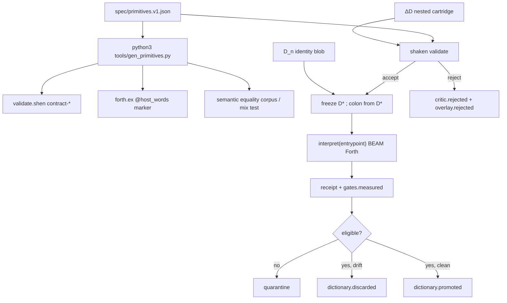

# Harness cartridge: a proof-carrying Forth dictionary

**Author:** TBD
**Date:** 2026-08-28
**Status:** Draft
**Supersedes:** nothing. Extends [`STORE.md`](STORE.md), [`GRAPH.md`](GRAPH.md), [`../ARCHITECTURE.md`](../ARCHITECTURE.md), [`../HARNESS.md`](../HARNESS.md).

---

## Overview

Living Dictionary is a certified harness microkernel. The planner emits a
plan envelope. A non-LLM critic Accepts or Rejects it. Forth then runs with
the model absent. Success is claim discharge, never “the model stopped.”

The next organism is **not** a Forth VM rewriting itself during execution,
and **not** JIT-Agent cloned into Forth wordlists that call the model. It is
a **proof-carrying, versioned Forth dictionary** that may change only at
episode boundaries. The generated object is a **harness cartridge**: a
**nested** episode overlay over a frozen parent dictionary `D_n`, carrying
a declarative memory view, a capability/effect grant, colon-word
definitions, and an entrypoint. Shen admits the overlay. The host freezes
that dictionary for the whole episode, installs overlay words from the
frozen snapshot only, executes the **entrypoint** (not the proposing `:`
stream), and lets external evidence decide whether the overlay is
**promoted**, **quarantined**, or **discarded**. Family-scoped **narrow**
is a later, post-hoc shrink — not the same-episode evidence gate, and
not required for Exp 0.

JIT-Agent ([arxiv 2608.25593](https://arxiv.org/abs/2608.25593), *Scaling
Harness Intelligence via Just-in-Time Harness Evolution*) generates four
Python modules `(M, P, A, F)` around a frozen backbone, validates them
syntactically, repairs mid-run, and updates an archive after a completed
rollout. This design maps their **streaming transaction boundary** onto a
Forth dictionary. It does not generate a ReAct loop, a `COMPLETE` host
word, `planning.py`, or new host primitives.

The hardest engineering problem is **proof/runtime semantic drift** across
the four bodies (Python `harness/`, OpenResty `openresty/`, browser
`browser/`, BEAM `beam/`). This spike pins **Shen + BEAM**: one
machine-readable primitive specification generates those tables (not
method bodies) and their fixtures. Python/Lua/JS lockstep is follow-on.
Proof admits; receipts audit. The live overlay host is BEAM.

---

## Background & Motivation

### What already exists

The loop is specified in [`docs/HARNESS.md`](../HARNESS.md) and implemented
in four bodies. The model is off while words run. Job state lives in
`run_dir`, not the product tree. The six-word eval 1.0 ABI is frozen
(`READ-FILE LIST-DIR SEARCH WRITE-FILE RUN-TESTS/RUN-GATES RECEIPT`).
`USE-ARTIFACT` is IR, not a new eval word: it pushes envelope bytes onto
the stack so Forth stays control flow
([`docs/ARCHITECTURE.md`](../ARCHITECTURE.md)).

Colon skills persist as `dictionary_dir/words/*.fs`. Hypothesis 5 of
[`eval/docs/EVALUATION.md`](../../eval/docs/EVALUATION.md) is
**procedural learning**: promoted words reduce cost on later family
members. Sequence-8 negative transfer is the *go/no-go* paragraph of
that same doc (and every family’s `*-08` `false_friend` mechanism), not
H5 itself.

Layer A of [`STORE.md`](STORE.md) already interns word source as blobs and
projects `dictionary.promoted` into datoms (`:word/content`,
`:word/promoted-by`). `store.as_of(seq)` returns a workspace tree
`{path: sha256}` only — STORE prose that mentions “job state” is
aspirational; this design does **not** overload `as_of` into
dictionary-as-of. Dictionary provenance is a separate fold over overlay
and promotion events.

### Current dictionary reality (do not paper over)

| Body | Load | Persist | Critic on colon bodies |
|---|---|---|---|
| Python `harness/src/livingdict/dictionary.py` | `load_prelude`: **all** `words/*.fs`, `sorted(glob)` alphabetical. Does **not** filter `SAFE_NAME` (only `loaded_names` does). | `save_colon_words`: `: NAME body ;`, no contract. `RESERVED` skipped at persist (includes `:` `;`, which are not in `HOST_DICTIONARY`). | `preflight.py` binds colon names as `Contract(0, 0, ∅)` and skips the body (`_skip_colon`). Graph checks live here. Docstring claims it implements `harness/shen/contracts.shen`; the live compositional critic is not that file. |
| OpenResty `openresty/lua/dictionary.lua` | same alphabetical load-all | same contractless persist | Live OpenResty critic is `openresty/shen/preflight.shen` via `bridge.lua` (ARCHITECTURE). Portable source of truth for BEAM/browser shake is `shen/critic/validate.shen`. Graph still serial. |
| Browser `browser/js/forth.js` | `HOST_DICTIONARY` has inputs/outputs **and** `effects` arrays; colon bind is `{inputs:0,outputs:0,effects:[]}` | UI dictionary pane; same tiny VM | `browser/shen/` copies; follow-on lockstep, not this spike |
| BEAM `beam/lib/ld_host/dictionary.ex` | `load_prelude`: **topo-ordered** by a **private** `defp topo_order/1`; cycles dropped | `save_words` requires an in-band `( ins -- outs \| effects )`; contractless words are never persisted | Live critic is `shen/critic/validate.shen` via `LdHost.Critic` |

Promotion is already two different machines:

- Python `execute._promote_colon` **writes** `*.fs` as soon as Forth
  finishes, before gates. `cli.py` then commits `dictionary.promoted`,
  measures gates, and only then records `dictionary.promotion_evidence`
  via `promotion.evidence_for`. Evidence is advisory relative to the
  files on disk.
- BEAM `LdHost.Run.promote/5` splits candidates vs prelude, requires
  `report.ok == true` **and** `Contracts.canonical/1`, writes only then,
  and commits `dictionary.promotion_evidence` with
  `eligible: false` plus `missing contract` / `claims not discharged` for
  the rest (**quarantine**). Prelude is reloaded for the **next** episode.

Python `preflight.HOST_DICTIONARY` is numeric arity plus a flat effect
set. It does not walk colon bodies, does not reject recursion, does not
check contract mismatch, and does not join IF/ELSE/THEN on stack **shape**.
The live compositional critic is `shen/critic/validate.shen`
(`check-colon`, `walk-body`, `finish-colon`): declared contract must
match computed `(in, out, sorted effects)`, recursion is rejected
(`recursive colon definition NAME is not supported`), literal
`WRITE-FILE` paths in bodies are glob-checked
(`check-colon-body-path` in `shen/critic/suite-tests.shen`).
`harness/shen/contracts.shen` is **documentary** (`write-ok?` is
`element?`, not fnmatch) and is not that critic.

Retrieval today is not retrieval. Python
`execute.run_forth` emits `dictionary.retrieve` with `"query": "*"` and
every `loaded_names`. BEAM `LdHost.Run.observe/1` dumps the **entire**
prelude into the planner prompt under `HARNESS DICTIONARY`. That is the
load-all warm arm this design has to beat.

### Why JIT-Agent’s four modules do not transplant

JIT-Agent’s transaction is: generate Python, syntax-check, run a rollout
with the model still in a tool loop, repair, then Evo-GDPO the archive.
Living Dictionary’s transaction is: admit a program, **turn the model
off**, mutate the workspace, measure protected claims.

Generating `memory.py` / `planning.py` / `action.py` / `capability.py`
would throw away the only unique claim in
[`docs/design/reviews/SYNTHESIS.md`](reviews/SYNTHESIS.md): the plan is a
program the critic can reject before I/O. Generating a `COMPLETE` host
word, a `DIRECTIVE`/`REVISE` Forth romance, or a ReAct inner loop would
put the model back inside execution. Mapping their boundary onto a Forth
dictionary keeps the compression: a promoted word is a verified subgraph
you run without another model call ([`GRAPH.md`](GRAPH.md) step 2).

Pain, quantified from the code rather than a wish:

- Four independent `HOST_DICTIONARY` tables
  (`preflight.py`, `openresty/lua/forth.lua`, `browser/js/forth.js`,
  `shen/critic/validate.shen` `contract-inputs` / `contract-outputs` /
  `contract-effect`). BEAM Forth lists `@host_words` in `forth.ex` and
  trusts Shen for arities. One edit can make proof and runtime disagree.
- Python promotion is not evidence-gated. Warm folklore can land from a
  trapped or undischarged episode.
- Load-all prelude is the token and unused-word cost sequence-8 exists
  beside; first-shot seq-8 cannot yet *exclude* same-family false friends
  by contract unification (same family, overlapping path, typical
  matching stack). Exp 0 therefore does not pretend to.
- Python colon words are `(0,0,∅)` at the critic. BEAM closed that hole
  (`beam/README.md` “The type hole, closed”;
  `test/run_test.exs` starved-call before I/O). The Python reference
  tree still has it.

---

## Goals & Non-Goals

### Goals

1. One machine-readable **primitive contract spec** that generates
   **Shen + BEAM** tables and fixtures first, before any generated
   overlay. Python/Lua/JS tables are follow-on lockstep, not this spike.
2. BEAM is the **source of truth** for promotion (in-band contracts,
   evidence before persist, public topo, `path_region`/`effects` at
   persist). Load-all remains default. Do **not** port overlay execution
   into `harness/src/livingdict`.
3. A **versioned dictionary object** `D_n`, content-addressed by an
   **identity-only** hash, frozen for an entire episode. Overlays compose
   as `D_n ⊕ ΔD` and commit only after admission **and** evidence.
4. **Exp 0** (no generator): same planner, load-all warm vs
   grant+path retrieved subset over a **mixed-family** warm dictionary.
   Seq-8 is a **non-inferiority** check vs load-all. Kill switch for
   later overlay PRs: retrieved is not worse on seq-8 **and** reduces
   prelude size or unused-word load.
5. Shen **compositional judgments** that the Python preflight and the
   documentary `harness/shen/contracts.shen` do not already provide, and
   that are not host invariants.
6. **Exp 1**: planner-emitted nested cartridge, Shen-admitted, at most
   two *subsequent* critic-repair episodes after the first overlay
   reject. Measure against the frozen eval 1.0 protected verifiers. Do
   not train a 27B harness model.
7. **Promote / quarantine / discard overlay** as distinct transitions;
   **narrow** (family/region shrink) later, not required for Exp 0.
   Correctness strictly prior to reward, latency, or cost.
   `promotion.warm_run_allowed` / `LdHost.Verdict.warm_run_allowed`
   remain the preregistered **compare** go/no-go (≤5 points correctness
   loss vs *cold*, ≥25% token cut, no new policy violations, no
   negative transfer) — not a per-word persist predicate.

### Non-goals (spike and later)

- Generating planning module **P**, `planning.py`, or Forth words
  `DIRECTIVE` / `REVISE`.
- A `COMPLETE` host word.
- Layer C multi-agent `INSTALL`, obligation tuples as a second source of
  truth, model-facing `TAKE` / `OUT` ([`STORE.md`](STORE.md) Layer C
  stays shut).
- Rewriting HarnessFactory’s 13 scaffolds, or cloning JIT-Agent’s four
  generated Python modules.
- IMMEDIATE, CREATE/DOES>, ANS Forth, recursion with a decreasing
  measure (v1: reject recursion — already true in
  `validate.shen`).
- Mutating the VM, host primitives, critic, or frozen claims from inside
  an episode. After overlay admission, `:` is a runtime syntax error.
- A query language or GC over datoms.
- Editing `eval/` or `compare/runs/`. The six-word ABI stays frozen.
- Proving generated **application** code correct. The frozen acceptance
  contract plus the protected verifier remain the semantic judge.
- A Shen theorem that every path *mentions* `RUN-GATES`.
- Using per-task `counterexamples` / `dictionary.narrowed` as a
  prerequisite for Exp 0.
- A **Python overlay path** this spike: no shaken-validate ladder on
  the Python host, no cartridges on `bin/livingdict`, no eval
  `forth_shen` Exp 1 arm. The live body is **BEAM + Shen critic**.

---

## Key Decisions

1. **Cartridge, not four modules.** JIT-Agent’s `(M,P,A,F)` become
   host-owned projections and a Forth overlay, not generated Python.
   Rationale: the critic can only certify a concatenative program plus a
   grant; it cannot certify arbitrary Python.

2. **Nested `envelope.cartridge`, and fingerprint must see it.**
   Flatten-and-execute of the same `:` stream is banned. `kernel.fingerprint`
   and `LdHost.Envelope.fingerprint` (and envelope parse) include the
   canonical overlay object. Overlay-reject then repaired overlay `A′`
   with identical program/artifacts/tree must **not** trip `seen_plans`.
   Generating a planner is type-level prompt injection; P stays
   `client/planner.py` / `LdHost.Planner`. Envelope grammar, fingerprint
   duplicate-block, and stop-on-discharge stay.

3. **Generate only A, F, and a small declarative M at first.** Action
   topology + colon definitions + capability subset + a named
   `memory_view`. No new host words.

4. **Dictionary mutates only at episode boundaries.** Overlay is
   proposed, admitted, hashed, frozen, executed, then promoted,
   quarantined, or discarded. After `dictionary.overlay.admitted`, the
   VM colon table is **immutable**; overlay words are installed from
   `D*` only.

5. **Proof admits; receipts audit.** Shen never sees runtime bytes.
   Predicted effects from the admitted overlay are compared with
   receipt-observed effects (`gates.measured`, policy violations,
   write set). Drift is a **discard overlay** blocker, not a critic rewrite.

6. **One primitive spec; Shen + BEAM tables this spike.**
   `python3 tools/gen_primitives.py spec/primitives.v1.json` writes
   tables behind a marker in `shen/critic/validate.shen` and
   `beam/lib/ld_host/forth.ex`. Method bodies handwritten. Semantic
   equality tests against shaken Shen + `LdHost.Critic`, not
   byte-identical `HOST_DICTIONARY`. Python/OpenResty/browser tables
   are documented drift to close later — not this spike’s runtime.
   Codegen is PR 1; overlays are PR 6. Do not codegen
   `docs/ARCHITECTURE.md` in PR 1.

7. **Retrieval by unification against a *host* query, not embeddings
   and not a phantom stack contract.** Exp 0 query is grant + path
   (effects ⊆ grant, path_region ∩ grant, not forbidden). **No** family
   attribute in Exp 0. Warm a **mixed-family** dictionary so grant+path
   can drop other families' words. Sequence-8 same-family false friends
   typically still unify; first-shot seq-8 cannot use per-task
   counterexamples. Narrowing is **not** required for Exp 0.

8. **Exp 0 kill switch is non-inferiority plus size.** Retrieved must
   not be worse than load-all on seq-8 **and** must reduce prelude size
   or unused-word load. If both fail equally, that is not a kill.
   “Stop” = freeze `LD_DICT_MODE=load-all`, do not land overlay
   or Shen-judgment PRs, do not revert the primitive spec. A human
   reviews the compare receipt.

9. **Correctness before Pareto.** `PromotionEvidence.eligible` /
   BEAM `report.ok` plus critic-accept is the **quarantine** gate.
   Token/latency ranking happens only among eligible words (PR 7).
   `warm_run_allowed` is a compare gate, not persist.

10. **Host invariant ≠ Shen theorem.** BEAM **measures** after an
    accepted episode even if the program omitted `RUN-GATES`
    (`last_check || Gates.run/1`). The Python CLI does the same
    (`measure_workspace`) but is not the overlay host. Only the
    **client** path (`client/job.py:ensure_run_gates`) inserts tokens
    **before** critic. If overlay admission wants those tokens in the
    program the critic sees, port `ensure_run_gates` into BEAM compose —
    a host change, not a new word, not a sequent.

11. **No Python overlay path.** The live body for cartridge / overlay /
    Exp 0 / Exp 1 is **BEAM** (`beam/`) + **Shen critic**
    (`shen/critic/`). Do not add a Python shaken-validate ladder, do
    not make `bin/livingdict` execute cartridges, do not treat eval
    `forth_shen` as an Exp 1 arm. PR 2 is BEAM persist identity
    (`path_region` / `effects`, public `topo_order`), not “Python ≡
    BEAM.” Python `HOST_DICTIONARY` is frozen-reference drift, closed
    later.

12. **Eval stays the laboratory.** Experiments consume `eval/` tasks
    read-only. New runners live under `beam/bench/` (this spike).
    Never edit oracles, `task_graph.json`, or hidden tests. `mix test`
    on `beam/` must stay green; `make test` remains the Python
    reference suite and is not the overlay runtime. Feature flags
    default off (`LD_*`, including existing `LD_DICTIONARY`).

13. **Live-job family tags are empty.** Grant+path retrieval still
    works. Family tags are lab-only (`eval` `task.toml`) until a later
    design.

---

## Proposed Design

### 1. Module mapping (grant, not generated Python)

| JIT module | living_dict representation | Shen’s job |
|---|---|---|
| Memory **M** | Task-specific projection over `store.facts()`, `store.as_of()`, last `gates.measured` / discharge, selected workspace files. Host-owned. Cartridge carries only a declarative `memory_view` name. | Prove the view **name** is in the enum and read-only. Byte caps stay **host** constants (`observe_workspace` 80k; BEAM 8k/file 60k total). The host builds the bytes. |
| Planning **P** | Keep `client/planner.py` / `LdHost.Planner` stable. Envelope remains `{language, program, artifacts, rationale, nodes?}` plus nested `cartridge`. | Prove the episode **entrypoint** plus `cartridge.definitions` (authoritative map). Directives are not Forth words. |
| Capability **F** | Allowed primitives, effects, globs, artifacts, cost/fuel. Strict subset of the host grant (`allowed_effects` `{read, write, exec}`, `allowed_globs`, `forbidden_globs`, SCUD `grant.*` when present). Cartridge `capabilities` use the **same** three names; `exec` means **gates-only** (`RUN-GATES`/`RUN-TESTS`), not a shell. | Prove capability/effect subsets, path safety, artifact availability. No new host words. |
| Action **A** | Forth **entrypoint**, colon words in `cartridge.definitions`, artifact DAG / `action_topology`, wave strategy already in `livingdict.wave`. | Prove stack safety, call-graph acyclicity, disjoint writes, bounded execution. |

Spike generates **A**, **F**, and a small declarative **M**. P is not
generated.

### 2. Cartridge schema (nested overlay)

**Decision: nest.** `cartridge` is a sibling of `program` / `artifacts`.
Flatten-and-execute of the proposing `:` stream is banned.

Required keys (unknown keys → `EnvelopeError` / parse error):

`parent`, `memory_view`, `action_topology`, `capabilities`, `budget`,
`definitions`, `entrypoint`.

```json
{
  "language": "forth",
  "program": ": INSTALL-CONFIG ( key -- receipt | read, write ) DUP USE-ARTIFACT SWAP WRITE-FILE ;\nINSTALL-CONFIG RUN-GATES RECEIPT",
  "artifacts": { "app/config.py": "<full file>" },
  "rationale": "never executed",
  "cartridge": {
    "parent": "sha256:…",
    "memory_view": "last-discharge+changed-files",
    "action_topology": "artifact-dag",
    "capabilities": ["read", "write", "exec"],
    "budget": {"writes": 8, "execs": 2},
    "definitions": {
      "INSTALL-CONFIG": ": INSTALL-CONFIG ( key -- receipt | read, write ) DUP USE-ARTIFACT SWAP WRITE-FILE ;"
    },
    "entrypoint": "INSTALL-CONFIG RUN-GATES RECEIPT"
  }
}
```

Constraints:

- `parent` is a dictionary content hash already interned in Layer A, or
  the empty dictionary (cold). Display form `sha256:` + 64 lowercase hex.
- `memory_view` ∈ `{last-discharge+changed-files, facts-as-of-last-gates, workspace-head}`. Enum-validate. The host implements the projection.
- `action_topology` ∈ `{sequential, artifact-dag}`. The latter is today’s
  `envelope.nodes` + Kahn waves. No `PAR` / `FORK` words
  ([`GRAPH.md`](GRAPH.md) step 3).
- `capabilities` ⊆ `{read, write, exec}` (same names as
  `allowed_effects`). `exec` means gates-only. Grant subset check is
  `set(capabilities) ⊆ host.allowed_effects` with `exec` implying
  `RUN-GATES`/`RUN-TESTS` only.
- `budget` is `{writes: int ≥ 0, execs: int ≥ 0}`. Distinct from kernel
  `budget.consumed` `{steps: 1}` (episode count). Abstract fuel for the
  critic; runtime may still trap earlier.
- `definitions` values are colon sources with in-band contracts. Names
  match `dictionary.SAFE_NAME` (`^[A-Z][A-Z0-9-]{0,62}$`) and are not in
  `RESERVED`.
- `entrypoint` is Forth using host words, parent dictionary words, and
  overlay names. It must **not** contain `:`. **`cartridge.definitions`
  is authoritative.** The host may extract colon defs from `program`
  **only for names absent from that map**. If the same name is present
  in both and the bodies differ, `EnvelopeError` (do not silently
  pick). Once a cartridge is present, executed text is **entrypoint
  only**; colon in `program` is fingerprint material and planner habit,
  not VM source.

Richer than this object is out of scope.

#### Fingerprint (critical)

Today `kernel.fingerprint` (`kernel.py`) hashes normalized program
tokens, per-artifact body hashes, and optional `nodes` material. It
does **not** hash unknown keys. `cli.py` sets
`dedupe_key = f"{fp}:{episode_tree_before}"`.
`LdHost.Envelope.fingerprint/1` hashes tokens + artifact hashes only
(no `nodes`, no unknown keys); `parse/1` drops unknown keys.

**Change:** parse **and** fingerprint include the canonical overlay
object (same canonical JSON as interned overlay: sorted keys, no
insignificant whitespace, interned bodies as 64-hex). Nested
`cartridge` is a first-class envelope field, not an unknown key.

An overlay-reject episode does not mutate the tree. A repair that only
replaces `cartridge.definitions` / grant / `entrypoint` **must** yield a
new fingerprint so `seen_plans` does not fire.

**Test (BEAM ledger + CLI):** admit-path not required. Reject
overlay `A`; resubmit overlay `A′` with **one name in
`cartridge.definitions` replaced** and identical `program` /
`artifacts` / tree; expect `pending_execute=true` and the critic to
run (not `episode.blocked_duplicate`) against **`A′`'s map**, not the
stale `program` colon. Control: byte-identical cartridge resubmit
against the same tree still blocks.

If overlay admission wants `RUN-GATES` tokens in the program the critic
sees, port `ensure_run_gates` into BEAM compose **before** fingerprint
and critic. That rewrite is host-owned and fingerprinted. BEAM does
**not** currently insert those tokens; it **measures** after the
episode anyway (`last_check || Gates.run/1`). The Python CLI is not
an overlay host this spike.

### 3. Dictionary versions (identity-only hash)

A dictionary is a Layer A interned blob, not a directory listing, and
not SCUD’s CAS tail. Evidence is **not** in the content hash.

Identity object (this is what `hash(D)` digests):

```
D_identity = {
  "parent": "<64 hex>" | null,
  "primitive_contract": "<64 hex>",
  "words": {
    "<NAME>": {
      "source": "<64 hex>",
      "contract": "( key -- receipt | read, write )",
      "effects": ["read", "write"],
      "callees": ["DUP", "USE-ARTIFACT", "SWAP", "WRITE-FILE"],
      "path_region": ["app/**"],
      "primitive_contract": "<64 hex>"
    }
  }
}
```

Canonical JSON for hashing and intern:

- UTF-8
- keys sorted lexicographically at every level (`sort_keys=True`)
- no insignificant whitespace (`separators=(',', ':')`)
- word names sorted
- `effects`, `callees`, `path_region` sorted
- interned blobs as 64-char lowercase hex, **no** `sha256:` prefix
  inside the hashed object (the prefix is display/ledger only)
- no `episode`, `gates`, `cost`, `latency_ms`, `tokens`, `replay_ok`,
  `counterexamples`, `task_families`
- at persist (PR 2): `effects` from the in-band contract; `path_region`
  = glob-union of literal `WRITE-FILE` paths in the body, else the
  episode `allowed_globs`

`hash(D) = SHA-256(canonical bytes)`, displayed `sha256:<hex>`.

Law:

```
D_{n+1} = intern(D_n ⊕ ΔD)
  only after
Γ; Σ ⊢ ΔD : Harness(M, P, F, A)
  ∧ Effects(ΔD) ⊆ Grant
  ∧ Bounded(ΔD)
  ∧ eligible(evidence)
```

`Γ` is the primitive-contract version **and** the parent word table.
`Σ` is the host grant. Commit is a kernel event plus a Layer A intern,
not an in-place `*.fs` overwrite.

Evidence (episode, gates, policy, cost, latency, tokens, replay,
counterexamples, task-family scope after a measured false friend) lives
on `dictionary.promotion_evidence` / `dictionary.narrowed` /
`dictionary.discarded` and `store.facts` (`:word/promoted-by` already
exists). Two runs of the same admitted source mint the **same** `D*`
even if wall time differs.

Rollback is selecting a previous `hash(D)`. There is no VM undo.

### 4. Self-modification rule (additive, transactional)

**v1 VM rule:** after `dictionary.overlay.admitted`, the colon table is
immutable and `:` is a **syntax error** at runtime. Overlay words are
installed from `D*` only. The host builds the overlay **before** the
critic from **`cartridge.definitions`** (authoritative), filling names
absent from that map by extracting colon defs from `program`; a
same-name body mismatch is `EnvelopeError`. The VM `interpret`s
**only** `entrypoint` tokens.

```mermaid
sequenceDiagram
  participant P as Planner (model)
  participant C as Critic (Shen)
  participant H as Host (model off)
  participant V as Protected verifier
  participant D as Dictionary intern

  P->>H: envelope + nested cartridge
  H->>H: definitions map authoritative; intern overlay blob
  H->>H: dictionary.overlay.proposed
  H->>C: validate(D_n ⊕ ΔD, grant, primitive_contract, entrypoint)
  alt Reject
    C-->>H: errors
    Note over H: critic.rejected AND dictionary.overlay.rejected<br/>one pending_execute=false
    H-->>P: next episode (repair, not halt)
  else Accept
    C-->>H: predicted effects, fuel, word table
    H->>D: dictionary.overlay.admitted (D*)
    H->>H: freeze D*; install colon from D* only
    H->>H: interpret(entrypoint); `:` is syntax error
    H->>V: measure gates (even if entrypoint omitted RUN-GATES)
    V-->>H: discharge report + receipt effects
    H->>H: compare predicted vs observed
    alt not eligible
      H->>H: quarantine (no words/ write, no dictionary.promoted)
    else eligible and no effect-drift
      H->>D: dictionary.promoted (D_{n+1} intern)
    else admitted ΔD not committed
      H->>H: dictionary.discarded
    end
  end
  Note over D: dictionary.narrowed is later, post-hoc,<br/>family/region shrink — not this episode, not Exp 0
```

Steps, in order:

1. Host builds a **transient overlay** from `cartridge.definitions`
   (interned blob, not on the live prelude). Emit
   `dictionary.overlay.proposed`.
2. Check overlay + transitive dependencies against `D_n` and the grant.
3. On accept: emit `dictionary.overlay.admitted` with content hash
   `D* = hash(D_n ⊕ ΔD)` (identity-only).
4. **Freeze** `D*` for the entire episode. Bind VM colon from `D*`
   before `interpret`. `prepare_program` takes that hash, not a
   directory glob.
5. Execute **entrypoint** only. Collect evidence.
6. **Quarantine** / **promote** / **discard overlay** afterward.
   `dictionary.narrowed` is not this step.

Forbidden:

- Redefining a word the current episode is executing.
- `:` after freeze (syntax error on BEAM Forth this spike).
- Mutating VM implementation, host primitives, critic sequent rules, or
  frozen claims.
- IMMEDIATE, CREATE/DOES>, compiling into the instruction stream.
- Planner-invented sequent rules in-episode.

Python `ForthVM._compile_colon` currently binds into `self.colon`
**during** `interpret` and `_exec_word` prefers `colon` over host words
— so an episode can shadow `READ-FILE` even though `save_colon_words`
skips `RESERVED`. BEAM `compile_colon` is the same (`Map.put(vm.colon,
…)` with colon checked first). Freeze plus reserved-name reject plus
runtime `:` error closes that.

**Forth tests (BEAM this spike):** reserved shadow rejected at critic;
`:` during frozen interpret fails; overlay name from `D*` is callable;
entrypoint that contains `:` is not executed as a definition.

Export BEAM topo as a **public** function (`topo_order` is `defp` in
`beam/lib/ld_host/dictionary.ex` today) (PR 2). Other bodies do not
run overlays this spike.

### 5. Retrieval (Exp 0): host query, not phantom ins/outs

The planner is frozen and does not emit queries. The **host** builds:

```
query = {
  grant_effects: host.allowed_effects,     // {read, write, exec}
  grant_globs: host.allowed_globs,
  forbidden_globs: host.forbidden_globs,
  path_region: grant write globs (intersection with word path_region)
}
```

A stored word matches iff `effects ⊆ grant_effects` and `path_region`
intersects the grant and does not intersect forbidden globs.
**Exp 0 does not filter on family attributes** (those wait until PR 7).

**No** `query.ins` / `query.outs`. **No** `counterexamples` / `not_in`.
Same-family false friends (config-07 word vs config-08) will typically
still unify. Mixed-family warm (union of sequences 1–7 **across
families**) is what lets grant+path drop *other* families' words so
prelude can shrink.

How identity fields are recorded at **PR 2 persist** (needed for Exp 0
index, not family tags):

- `effects` = the in-band contract's effect set.
- `path_region` = glob-union of literal `WRITE-FILE` paths in the colon
  body; if there are none, the episode's `allowed_globs`.

Implementation sketch, host-side, no model:

- Index is derived from `facts(events)` plus the identity dictionary
  blob. Attributes needed for Exp 0: `:word/effects`, `:word/region`,
  `:word/content`. Family/counterexample attributes wait for PR 7.
- `dictionary.retrieve` trace today (`query: "*"`) becomes this host
  query object. Candidates are names; prelude is **only those names**,
  topo-ordered via the now-public `topo_order`.
- Load-all remains an explicit arm (`query: "*"` / `LD_DICT_MODE=load-all`).

### 6. Primitive specification (do this before overlays)

Command:

```
python3 tools/gen_primitives.py spec/primitives.v1.json
```

Writes **tables behind a marker** in `shen/critic/validate.shen` and
`beam/lib/ld_host/forth.ex`. Method bodies in `forth.ex` stay
**handwritten**. Generating host-word *keys* without implementations is
forbidden. `RESERVED` keeps `:` `;` as a handwritten superset (they are
not host words). `RUN-GATES` and `RUN-TESTS` are **two** table entries.

```json
{
  "version": "1.0",
  "abi": "eval-1.0",
  "words": {
    "READ-FILE": {
      "inputs": 1,
      "outputs": 1,
      "effects": ["read"],
      "stack": "( path -- content | read )",
      "class": "host",
      "eval_abi": true
    },
    "RUN-GATES": {
      "inputs": 0,
      "outputs": 1,
      "effects": ["exec"],
      "stack": "( -- report | exec )",
      "class": "host",
      "eval_abi": true
    },
    "RUN-TESTS": {
      "inputs": 0,
      "outputs": 1,
      "effects": ["exec"],
      "stack": "( -- report | exec )",
      "class": "host",
      "eval_abi": true
    },
    "USE-ARTIFACT": {
      "inputs": 1,
      "outputs": 1,
      "effects": ["read"],
      "stack": "( key -- content | read )",
      "class": "ir",
      "eval_abi": false
    },
    "IF": {
      "inputs": 1,
      "outputs": 0,
      "effects": [],
      "class": "control",
      "join": "shape"
    }
  }
}
```

Codegen targets **this spike** (tables only):

| Target | Today’s hand table |
|---|---|
| Shen `contract-inputs` / `contract-outputs` / `contract-effect` / `host-word?` | `shen/critic/validate.shen` — emit clauses that still typecheck under `yggdrasil check` |
| Elixir `@host_words` / `@stack_words` (marker) | `beam/lib/ld_host/forth.ex` |

**Follow-on lockstep (not this spike):** Python
`preflight.HOST_DICTIONARY`, Lua `openresty/lua/forth.lua`, JS
`browser/js/forth.js`, copies under `openresty/shen/` and
`browser/shen/`. Leaving them ungenerated is a documented drift risk.

Do **not** codegen `docs/ARCHITECTURE.md` in PR 1. Require **semantic
equality** on the spike corpus: shaken Shen `validate` and
`LdHost.Critic` — same Accept/Reject class and the same error
*substrings* (underflow, unknown word, forbidden path, no artifact,
colon mismatch, recursion). `harness/shen/contracts.shen` stays
documentary.

Admission records `primitive_contract` (64 hex of the spec blob) on
`dictionary.overlay.admitted`. A dictionary built against spec `1.0`
cannot silently run on a VM that loaded `1.1`. Mismatch is critic
unavailable / halt, not a best-effort walk.

Runtime audit: critic predicted `effects` vs receipt-observed writes /
execs. Extra observed effect → **discard overlay** (`effect-drift`),
not a hash change of `D`.

### 7. What Shen should prove (compositional, not documentary arities)

`harness/shen/contracts.shen` documents stack comments and a naïve
`write-ok?` (element-of, not fnmatch). Ignore it as an oracle. The
live file is `shen/critic/validate.shen`. Python
`livingdict.preflight.validate` is the lab mirror and is **weaker** on
colon bodies; graph rules are **stronger** there (Stage-1 in
`_graph_errors`). Parity is a goal of this work, not a current fact.
`validate.shen` already lists graph rules as TODO and says “do not ship
a weaker Accept.”

**Overlay admission is BEAM + `shen/critic/validate.shen` via
`LdHost.Critic`.** There is no Python overlay path this spike. Do not
grow IF/ELSE shape + colon effects inside `preflight.py`. Eval adapter
`forth_shen` stays the weaker lab mirror and is **out of Exp 1**.

Judgments for overlay admission (`Γ; Σ ⊢ ΔD : Harness`):

| Judgment | Current status | Spike |
|---|---|---|
| No stack underflow on any branch | Depth walk in both critics; Python resets depth to 0 after error (continues). Shen same idea on colon bodies. | Keep. Extend to IF/ELSE branches independently. |
| Stack **shape** agrees at IF/ELSE/THEN joins | **Absent.** `IF` is `Contract(1,0)`, `ELSE`/`THEN` are `(0,0)`. Depth is global. VM (`ForthVM._run_if`) executes one arm. | **Add** (PR 5). v1 shape = depth + “same depth at join.” Typed slots later. |
| Transitive effects of colon words ⊆ grant | Shen accumulates body effects and checks declared vs computed. Python colon = `∅` effects (reference hole; not this spike’s runtime). | Overlay check includes parent word effects (Shen on BEAM). |
| Literal writes inside allowed globs, outside forbidden | Both; Shen `special-checks` on bodies (`colon-body-forbidden-path`). | Keep. Non-literal writes remain a runtime policy trap (`PathPolicy.write_allowed`). |
| Artifact references exist | `USE-ARTIFACT` + artifact keys. | Keep. |
| Core/reserved words cannot be shadowed | Persist-time skip (`RESERVED`). Runtime colon can shadow in Python/BEAM VMs. | **Reject at critic** (PR 5, before overlays). |
| Colon call-graph acyclic | Shen rejects recursion, single-pass definition-before-use. BEAM private topo skips legacy cycles. | **Keep reject.** No decreasing-measure story in v1. |
| Node graph acyclic; concurrent nodes disjoint writes | Python `_graph_errors` / `write_sets_overlap`. Shen TODO. OpenResty serial. | Port the Python rules into `validate.shen` (already listed). Overlay `action_topology: artifact-dag` reuses `envelope.nodes`. |
| Terminating paths execute RUN-GATES | **Host measurement**, not token presence. See Key Decision 10. | **Do not** add a Shen theorem. |
| Abstract execution cost ≤ fuel | **Absent.** `budget.consumed` is episode **steps**. Cartridge `budget.writes` / `budget.execs` is new. | **Add** (PR 5): each `WRITE-FILE` / `RUN-GATES` / `RUN-TESTS` in the reachable call graph counts 1. |
| Proof checked against exact primitive-contract version | Absent. | **Add** as overlay field vs interned spec hash. |

Must **not** pretend to prove generated product files, hidden oracles,
planner rationale, non-literal paths, or model liveness.

#### Repair (Exp 1)

Cap = **two subsequent episodes after the first overlay reject**.
The first reject counts as the start, not as one of the two repairs.
A third reject → **stop overlay generation for that job** (continue
without cartridge; job `max_turns` / `reconcile` still apply — not an
automatic `halt_cap` unless the job cap is hit).

Repair is the **next episode**, never mid-interpret. Actor = existing
planner, prompted with critic error strings (`format-contract` mismatch
is already mechanical). Host **validates** the patch is exactly one of:

- replace **one** definition’s body/contract,
- narrow `capabilities` / `budget` / path region (grant **narrowing**,
  not family-counterexample `dictionary.narrowed`),
- change `entrypoint`.

No new host words, no grant widening, no sequent edits. Host rejects
any other delta as an overlay parse error (counts as a reject toward
the cap).

### 8. Memory view (declarative M)

v1 views, host-implemented in the planner observation path
(`cli.py` observation dict; `LdHost.Run.observe/1`;
`client/planner.py:observe_*`):

| Name | Projection |
|---|---|
| `last-discharge+changed-files` | last `gates.measured` report (scrubbed of hidden commands, as BEAM `gate_feedback` already does) + `policy.changed_files` / receipt `changed_files` |
| `facts-as-of-last-gates` | `store.facts(events)` rows up to last `gates.measured` seq, capped **by the host** |
| `workspace-head` | today’s truncated file dump (`observe_workspace` 80k, BEAM 8k/file 60k total) |

Shen checks: view name ∈ enum; no write effects. Observation byte caps
are **not** a grant field and are **not** a Shen theorem.

### 9. Event kinds and the datom view

Kernel kinds are a **closed set**. Today Python `kernel.EVENT_KINDS` and
`LdHost.Ledger.@event_kinds` match:
`episode.planned`, `critic.accepted`, `critic.rejected`,
`artifacts.applied`, `gates.measured`, `budget.consumed`,
`episode.blocked_duplicate`, `dictionary.promoted`,
`dictionary.promotion_evidence`, `contract.approved`. Unknown kinds
refuse the commit. This spike adds kinds to **BEAM** `@event_kinds`.
Python `EVENT_KINDS` stays frozen unless a later lockstep PR.

**Five new kinds** (add all five to BEAM `@event_kinds`):

| Kind | Role | `reduce` |
|---|---|---|
| `dictionary.overlay.proposed` | interned overlay, parent hash, definition names, primitive_contract | record-only (like `DICTIONARY_PROMOTED`) |
| `dictionary.overlay.admitted` | identity `D*`, predicted effects, fuel, critic engine+version | record-only; freeze pointer is a **host fold**, not a `State` field |
| `dictionary.overlay.rejected` | errors[] (same strings as `critic.rejected`) | record-only. **Coincides** with `critic.rejected` in the same episode: emit both; **one** `pending_execute=false` (the existing `critic.rejected` transition). Do not double-clear. |
| `dictionary.narrowed` | post-hoc family/region/effects shrink; counterexample id | record-only. Not Exp 0. |
| `dictionary.discarded` | admitted `ΔD` not committed (effect-drift or failed gates) | record-only |

Existing: `dictionary.promoted` (extend payload with contract,
`parent_dict`, `primitive_contract` — identity fields, not latency);
`dictionary.promotion_evidence` (keep; BEAM already gates persist on
eligibility).

`kernel.State` does **not** grow `dictionary_hash`. Crash/resume (eval
sequence 5) restores freeze by **folding overlay events**:

```
freeze_of(events) -> {dictionary_hash, overlay_hash, primitive_contract} | empty
  last = empty
  for e in events in order:
    if e.kind == dictionary.overlay.admitted:
      last = {dictionary_hash: payload.dictionary_hash,  # hash(D*)
              overlay_hash: payload.overlay_hash,        # interned ΔD
              primitive_contract: payload.primitive_contract}
    # overlay.rejected / proposed / discarded / promoted / narrowed
    # do not move the freeze pointer of an already-admitted episode.
    # A later overlay.admitted replaces last (next episode).
  return last
```

Host on resume: if `freeze_of` is non-empty and the current episode has
`overlay.admitted` without a terminal gates/promote, reinstall colon
from that `D*` before any `interpret`. `kernel.reduce` stays ignorant
of the hashes (same pattern as promoted words today).

Tests: BEAM ledger / `run_test.exs` — unknown kind refused;
overlay.rejected does not halt; overlay.admitted replay restores freeze
via the host fold; fingerprint test in §2.

#### Ledger facts (explicit projection, not a slogan)

Python `store.facts()` is a closed `if/elif` in `store.py` (frozen
reference). This spike projects the same rows from the **BEAM ledger**.
Shape:

```
dictionary.overlay.proposed:
  (overlay/<overlay_hash>, :overlay/parent, dict/<parent>, seq)
  (overlay/<overlay_hash>, :overlay/primitive-contract, <hex>, seq)

dictionary.overlay.admitted:
  (overlay/<overlay_hash>, :overlay/verdict, :admit, seq)
  (overlay/<overlay_hash>, :overlay/effects, "<sorted effects>", seq)
  (dict/<dictionary_hash>, :dict/parent, dict/<parent>, seq)

dictionary.overlay.rejected:
  (overlay/<overlay_hash>, :overlay/verdict, :reject, seq)
  (episode/N, :critic/error, <each error>, seq)  # only if not already
                                                 # projected from critic.rejected
                                                 # — prefer critic.rejected rows;
                                                 # do not duplicate errors

dictionary.promoted:  # existing +
  (word/<NAME>, :word/content, blob:<hex>, seq)
  (word/<NAME>, :word/promoted-by, episode/N, seq)
  (word/<NAME>, :word/contract, "<contract>", seq)
  (word/<NAME>, :word/dict, dict/<hash>, seq)
  (word/<NAME>, :word/effects, "<sorted>", seq)
  (word/<NAME>, :word/region, "<sorted globs>", seq)

dictionary.narrowed:
  (word/<NAME>, :word/narrowed-from, dict/<old>, seq)
  (word/<NAME>, :word/counterexample, <task id>, seq)

dictionary.discarded:
  (overlay/<overlay_hash>, :overlay/verdict, :discard, seq)
```

`as_of` continues to mean **workspace** tree `{path: sha256}`.
Dictionary-as-of is the freeze fold above plus identity blobs, used by
retrieval, not by receipts.

Trace (not kernel), keep and extend:
`dictionary.retrieve` / `dictionary.reuse`, `dictionary.promote` /
`dictionary.quarantined` (BEAM traces), `preflight.rejected`,
`execution.trap`, `graph.*`, `space.*`. Overlay kinds are **not** tuple
kinds. Layer C remains shut.

### 10. Freeze, bodies, and prelude load



Body-specific notes:

- **BEAM (this spike):** live overlay host. Export `topo_order`. Bind
  episode to `D*` via `freeze_of`; do not `load_prelude` again
  mid-episode after admit. Record `effects` / `path_region` at persist
  (PR 2).
- **Python / OpenResty / browser:** frozen semantic reference. No
  overlay execution, no cartridge flag, no Exp 0/1 arms. PR 1 does not
  require regenerating their `HOST_DICTIONARY` tables. OpenResty waves
  stay serial (resolved default). Eval `forth_shen` stays preflight
  (**weaker**) and out of Exp 1. Do not change `eval/schemas/`.

---

## API / Interface Changes

### Envelope (nested, parsed, fingerprinted)

`LdHost.Envelope` gains required-when-present `cartridge` with the
schema in §2. `LdHost.Envelope.parse/1` rejects unknown cartridge keys
and missing required keys. `LdHost.Envelope.fingerprint/1` includes
canonical cartridge JSON (today it hashes tokens + artifact hashes
only and `parse/1` drops unknown keys). Python `PlanEnvelope` /
`kernel.fingerprint` are the frozen reference and are **not** the
overlay parse path this spike.

No new Forth words. No model-facing store verbs.

### Critic

```
validate(program=entrypoint, allowed_effects, allowed_globs, forbidden_globs,
         artifacts, nodes?, task_graph?,
         overlay?, primitive_contract?)
```

The host passes **entrypoint**, not the proposing `:` stream.
`overlay` is the parsed cartridge; `primitive_contract` is the spec
hash the VM loaded. Return value grows `predicted_effects`,
`abstract_cost`, `bound_words` (name → contract).

Numeric Python preflight never admits overlays. There is no Python
shaken-validate ladder this spike.

### Host / CLI

BEAM compose binds **frozen** prelude from `D*` + **entrypoint**.
Optional: port `ensure_run_gates` into BEAM compose if admission should
see those tokens (fingerprinted). Planner observation lists retrieved
word names and contracts (`LdHost.Run.observe/1` already lists
names+source). `bin/livingdict` does not execute cartridges.

SCUD `rho.run/v1` is unchanged ([`docs/SCUD.md`](../SCUD.md)). Cartridge
`capabilities` ⊆ grant `allowed_effects`; widening is deny-by-default.

### Promotion API

Keep BEAM `promote/5` quarantine and `LdHost.Verdict.warm_run_allowed`.
`eligible` remains the **quarantine** gate (critic accepted ∧ clean
execution ∧ claims discharged ∧ no policy ∧ no trap ∧ replay_ok).
Additive fields for audit, not identity:

```python
contract: str | None
parent_dict: str | None
primitive_contract: str | None
predicted_effects: tuple[str, ...]
observed_effects: tuple[str, ...]
effect_drift: bool
```

Effect-drift with otherwise eligible evidence → **discard overlay**,
not `dictionary.promoted`. Missing eligibility → **quarantine** (no
`words/` write). `warm_run_allowed` is not consulted per word.

Three distinct persist transitions:

1. **Quarantine** — not eligible. BEAM `promote/5` already. Intern
   candidate; do not write `words/` or commit `dictionary.promoted`.
2. **Discard overlay** — admitted `ΔD` not committed (effect-drift or
   failed gates after admit). Exp 1 / PR 7.
3. **Narrow** — post-hoc family/region/counterexample shrink after a
   *measured* false friend. PR 7. **Not required for Exp 0.**

---

## Data Model Changes

### On disk

```
run_dir/dictionary/                 # compatibility checkout of words/*.fs
run_dir/objects/<aa>/<sha256>       # already: blobs, including word source
                                    # and D_identity canonical JSON
```

`words/*.fs` is a checkout of promoted identity, written **only** on
`dictionary.promoted`. Authority is the interned `hash(D)` recorded on
`dictionary.overlay.admitted` / `dictionary.promoted`. Do not glob-load
during a frozen episode.

Migration: old dictionaries without contracts load as **quarantine**
(BEAM already does this for persist). They may appear in the load-all
arm only. No silent `(0,0,∅)` promotion.

### Kernel

Add the **five** kinds to BEAM `LdHost.Ledger.@event_kinds` (and
`kernel.EVENT_KINDS` only if the frozen Python reference is touched
later — not this spike). `reduce` as in §9. Host freeze fold on resume.
Tests as named above.

---

## Experiments

Both experiments use **`LdHost.Planner`** (grok-4.6). Do not train a
harness model. Do not edit `eval/`. Protected verifiers remain hidden.
Pin model id, sampling, budgets, ≥3 reps, randomized arm order
([`EVALUATION.md`](../../eval/docs/EVALUATION.md)). Named runner under
`beam/bench/`. A **human** reviews the compare receipt; this is not CI
folklore.

Preregistered warm go/no-go vs **cold** (already coded; compare gate):

```
success_delta_points ≥ -5
token_reduction_fraction ≥ 0.25
policy_violations_increased = false
negative_transfer = false
```

(`LdHost.Verdict.warm_run_allowed`; Python `promotion.py` is the
frozen reference). Exp 0’s kill switch is **not** this predicate.

### Exp 0 — retrieval vs load-all (no generator)

**First. Protocol:**

- Warm a **mixed-family** dictionary: union of sequences 1–7
  **across all eval families** (not one family at a time). That is
  what makes grant+path shrinkage possible.
- Score every `*-08` (`eval/tasks/config-08/task.toml` etc., mechanism
  `false_friend`), ≥3 reps, pinned model.
- Host query = grant + path (§5). **No** phantom ins/outs. **No**
  family attribute. **No** per-task counterexamples. **No**
  `dictionary.narrowed` required.
- Arms: warm load-all vs warm retrieved. Same planner, same frozen
  claims.

Metrics (primary): prelude size (bytes and word count), unused loaded
words vs `dictionary.reuse`, input/output tokens, model calls, critic
rejects, wall time.

Seq-8: **non-inferiority vs load-all** (retrieved must not be worse
than load-all on seq-8 success). If both fail equally, that is not a
kill.

**Kill switch for proceeding to overlay / Shen-judgment PRs (PR 5+):**
retrieved is non-inferior on seq-8 **AND** reduces prelude size **or**
unused-word load. Verdict recorded by a human from the compare receipt.

**“Stop” means:** freeze `LD_DICT_MODE=load-all` (default). Do
**not** land PR 5 (Shen overlay judgments) or PR 6 (cartridge). Do
**not** revert PR 1 (primitive spec). PR 2–3 (BEAM persist identity,
identity hash) may already be merged and stay.

### Exp 1 — Shen-admitted overlay

Four arms, same tasks (eval 1.0 families; live compare optional):

| Arm | Dictionary | Generator |
|---|---|---|
| Cold fixed Forth | host prelude only | none (canned or planner without overlay) |
| Warm load-all | all `*.fs` | none |
| Warm retrieved | Exp 0 loader | none |
| Retrieved + overlay | retrieved ∪ admitted ΔD | planner emits nested cartridge; repair cap §7 |

Overlay schema: no richer than §2. No new host words, no arbitrary
Python. **BEAM-only.** `forth_shen` is out.

Metrics: protected-verifier success, model calls/tokens, critic
rejection count, repair count (0–2 subsequent), policy violations,
wall time, replay determinism (same envelope + `D*` identity → same
tree hash), seq-8 non-inferiority, dictionary growth (promoted words)
and reuse rate, effect-drift **discards**, quarantine count.

Do **not** run Exp 1 until: primitive spec + Shen/BEAM fixtures green
(`mix test` in `beam/`), `D_n` identity freeze exists, Exp 0 said go,
`LdHost.Critic` admits overlays.

---

## Alternatives Considered

### A. Generate four Python modules like JIT-Agent

Wrap the frozen LLM with `memory.py`, `planning.py`, `action.py`,
`capability.py`; syntax-check; mid-run repair; archive after rollout.

**Trade-off:** closest to the paper; zero leverage of Shen or Forth;
puts the model back in a tool loop; cannot share one critic across
Python/Lua/JS/BEAM; eval 1.0 ABI would grow. **Reject.**

### B. JIT-Agent cloned into Forth wordlists that call the model

New words `PLAN`, `COMPLETE`, `REVISE` that trap into the planner
mid-episode.

**Trade-off:** looks like a dictionary; actually a ReAct loop with extra
tokens. Breaks “model off while words run.” Unreplayable without the
model. **Reject.**

### C. Self-modifying Forth (IMMEDIATE, CREATE/DOES>, rewriting during `interpret`)

**Trade-off:** classic Forth romance; makes freeze-for-episode
unrepresentable; four VMs would diverge immediately; critic would have
to model a moving instruction stream. This VM is tiny on purpose
(`forth.py` docstring). **Reject.** v1: `:` is a syntax error after
admit.

### D. Embedding retrieval over word source / rationale

**Trade-off:** easy; sequence-8 is exactly the similarity trap
(legacy_mode vs compatibility_mode on `config-08`). Exp 0 does not
claim to exclude those friends by stack unification. Embeddings still
deferred until retrieval has numbers on prelude size.

### E. Keep Python `(0,0,∅)` preflight as the overlay critic

**Trade-off:** one language, already on the eval path. It cannot see
colon bodies. **Reject as overlay authority.** This spike is BEAM +
Shen; Python preflight is not an overlay host.

### F. Port overlay execution into Python `harness/` this spike

**Trade-off:** four-body freeze looks complete; the user does not want
a Python overlay path. Python remains the frozen reference.
**Reject this spike.** Follow-on lockstep later.

### G. Flatten cartridge into `program` so fingerprint “already works”

**Trade-off:** executing the proposing `:` stream rebinds colon
mid-interpret (the hole §4 closes). Nested + fingerprint extension is
the smaller VM change: extract, admit, interpret entrypoint only.
**Reject flatten-and-execute.**

---

## Security & Privacy Considerations

| Threat | Severity | Mitigation |
|---|---|---|
| Overlay widens grant (new effects, `**` globs, forbidden paths) | High | `capabilities` ⊆ `{read,write,exec}` ⊆ host grant; critic path checks; SCUD deny-by-default. Repair cannot widen. Unknown cartridge keys rejected. |
| Shadowing `WRITE-FILE` / `RUN-GATES` | High | Reserved-name reject; persist skip; after admit `:` is a syntax error; colon installed from `D*` only. |
| Type-level prompt injection (planner emits new sequent rules) | High | Sequent rules are not cartridge fields. Critic source is not in the workspace. |
| Proof/runtime drift (admitted write-free word writes) | High | Primitive spec version pin; predicted vs observed effects; **discard overlay** on drift (identity hash unchanged). |
| Memory view exfiltrates hidden oracle / gate commands | High | BEAM already strips check commands. Views are host projections with the same scrub. Caps stay in the host. |
| Path escape via overlay literals | Medium | Existing `workspace-rel` / `PathPolicy`; critic + runtime. |
| Dictionary poisoning via undischarged promotion | High | Quarantine before `dictionary.promoted` (BEAM `promote/5`). |
| Overlay repair swallowed as duplicate plan | High | Fingerprint includes canonical cartridge (§2 test). |
| Layer C / cross-process overlay smuggling | Medium | Overlay kinds are kernel events, not space tuples. Layer C shut. |
| Secrets in dictionary source or facts | Medium | No tokens in memory, prompts, logs, artifacts ([`AGENTS.md`](../../AGENTS.md)). |

Authn/z does not change: planner auth remains OAuth / `XAI_API_KEY`;
SCUD BIP340 witness still refuses before any effect in require-mode.

---

## Observability

- **Kernel log** (`events.jsonl`): five new kinds plus existing
  critic/gates/budget/promoted. Sequence monotonic. Single writer
  (`kernel.reduce`, `LdHost.Ledger`).
- **Trace** (`trace.jsonl`): retrieve query+candidates, reuse, repair
  patch kind, effect-drift details, critic engine (`LdHost.Critic.engine`
  already exists).
- **Metrics (Exp 0/1):** success, tokens, model calls, critic
  reject/repair, prelude bytes, word count, unused loaded words, seq-8
  vs load-all, wall time, replay tree-hash equality, effect-drift
  discards, quarantines.
- **Alert / go-no-go:** `warm_run_allowed` is the *compare* gate. Exp 0
  kill switch is human review of the compare receipt. Effect-drift > 0
  on a green fixture corpus fails CI.
- **CLI / traces:** BEAM ledger + `trace.jsonl`; overlay verdicts on
  kernel kinds in §9.

---

## Rollout Plan

Feature flags (BEAM env, default = today’s behavior). Existing
`LD_DICTIONARY` remains the dictionary directory (`LdHost.CLI`).

| Flag | Default | Meaning |
|---|---|---|
| `LD_DICTIONARY` | unset | Dictionary directory (already used). |
| `LD_DICT_MODE=load-all\|retrieved\|frozen-hash` | `load-all` | Exp 0 loader. |
| `LD_CARTRIDGE=0\|1` | `0` | Ignore `envelope.cartridge` until PR 6. If 0, drop/ignore the key (do not execute). |
| `LD_PRIMITIVE_CONTRACT` | shipped spec hash | Pin. |

Staged = the PR plan below. Flags stay off by default. Tests that must
stay green this spike: `mix test` in `beam/`. `make test` stays green
as the frozen Python reference (no overlay work required).

Rollback: set flags off; select previous dictionary hash; do not delete
blobs (Layer A is append-only, no GC). Identity hash does not include
latency, so rollback is stable.

---

## Risks

| Risk | Severity | Mitigation |
|---|---|---|
| Shen graph TODO vs Python graph (weaker Accept) | High | PR 5 ports `_graph_errors` into `validate.shen` before overlays; refuse a weaker Accept (`validate.shen` header). Python graph stays the lab mirror, not the overlay critic. |
| Exp 0 retrieved loses seq-8 vs load-all **or** does not shrink prelude | High | **Stop** overlay/Shen-judgment PRs. Keep spec + BEAM persist identity. Human receipt. |
| Planner emits huge overlays | Medium | Definition count cap (v1: ≤8 names, ≤2kB source); budget.writes/execs; critic fuel. |
| Four-body HOST_DICTIONARY drift | Medium | Accepted this spike. PR 1 generates Shen + BEAM only; Python/Lua/JS closed later. |
| Freeze vs in-program `:` surprises canned planners | Medium | `cartridge.definitions` is the VM source; `:` at runtime is a syntax error; `LD_CARTRIDGE=0` keeps today’s loop. |

---

## Resolved decisions (was Open Questions)

1. **Live-job family tags:** empty family scope on live jobs.
   Grant+path retrieval still works. Family tags are lab-only (`eval`
   `task.toml`) until a later design. Exp 0 does not persist or query
   family attributes.
2. **IF/ELSE shape:** v1 is **depth-only** join (“same depth at join”).
   Typed slots are a later sequent extension, not this spike.
3. **OpenResty waves:** stay **serial**. Overlay `action_topology:
   artifact-dag` is still checked; parallelism is not this spike.
   OpenResty is not an overlay host this spike.
4. **No Python overlay path.** Live body is BEAM + `shen/critic/`. No
   Python shaken-validate ladder, no cartridges on `bin/livingdict`,
   no Exp 1 `forth_shen` arm. Python/OpenResty/browser `HOST_DICTIONARY`
   lockstep is follow-on.

---

## References

- JIT-Agent: arxiv 2608.25593, *Scaling Harness Intelligence via
  Just-in-Time Harness Evolution*.
- [`docs/ARCHITECTURE.md`](../ARCHITECTURE.md) — four-body ABI, envelope, critic. OpenResty live critic: `openresty/shen/preflight.shen`.
- [`docs/HARNESS.md`](../HARNESS.md) — live loop; host-owned job state. Client-path insert of `RUN-GATES` vs post-episode measurement.
- [`docs/design/STORE.md`](STORE.md) — Layer A blobs/facts; `as_of` is workspace `{path: sha256}`; Layer C shut.
- [`docs/design/GRAPH.md`](GRAPH.md) — Forth as graph; colon words as reusable subgraphs.
- [`docs/SCUD.md`](../SCUD.md) — `rho.run/v1`; policy evaluator; grant mapping.
- [`docs/BROWSER.md`](../BROWSER.md) — portable critic split; no eval in shaken JS.
- [`eval/docs/EVALUATION.md`](../../eval/docs/EVALUATION.md) — H5 procedural learning; seq-8 in the go/no-go paragraph; families.
- [`beam/README.md`](../../beam/README.md) — typed promotion; critic ladder.
- [`harness/shen/README.md`](../../harness/shen/README.md) — Shen does not emit patches or call the model.
- Code: `dictionary.py` (`load_prelude`, `save_colon_words`, `SAFE_NAME` only on `loaded_names`/`save`), `promotion.py`, `preflight.py`, `kernel.py` (`fingerprint`, `EVENT_KINDS`, `reduce`), `store.py` (`facts`, `as_of`), `execute.py` (`_promote_colon`, `prepare_program`), `cli.py`, `client/job.py` (`ensure_run_gates`),
  `beam/lib/ld_host/dictionary.ex` (`defp topo_order/1`), `run.ex` (`promote/5`), `ledger.ex` (`@event_kinds`), `contracts.ex`, `verdict.ex`, `critic.ex`, `forth.ex`, `envelope.ex` (`parse/1` drops unknown keys, `fingerprint/1`),
  `shen/critic/{validate,contracts,suite-tests}.shen`,
  `openresty/lua/{dictionary,forth,agent,bridge}.lua`, `openresty/shen/preflight.shen`,
  `browser/js/forth.js` (`HOST_DICTIONARY` effects arrays).

---

## PR Plan

Incremental, independently reviewable, mergeable. No PR edits `eval/`.
Do not generate P, `COMPLETE`, Layer C INSTALL, or HarnessFactory
scaffolds. **BEAM + Shen first.** Python CLI files are not the primary
list. Feature flags default off (`LD_*`). Tests: `mix test` in `beam/`.

“CAS” here means Layer A intern of an identity blob, **not** td’s
attempt/execution CAS tail.

### PR 1 — Primitive spec + Shen/BEAM fixtures

- **Title:** Primitive contract spec generates Shen + BEAM host-word tables
- **Files/components:** `spec/primitives.v1.json`; `tools/gen_primitives.py`; marker blocks in `shen/critic/validate.shen` (yggdrasil-checkable clauses) and `beam/lib/ld_host/forth.ex`; fixture corpus under `beam/test/` and `shen/critic/suite-tests.shen`.
- **Depends on:** none.
- **Changes:** one spec hash is the primitive-contract version. Semantic equality on shaken Shen + `LdHost.Critic`. Method bodies handwritten. **Do not** codegen `ARCHITECTURE.md`. **Do not** require generating Python/Lua/JS tables this PR (documented drift). **Before any overlay work.**

### PR 2 — BEAM persist identity (effects, path_region, public topo)

- **Title:** Record effects and path_region at BEAM promote; export topo_order
- **Files/components:** `beam/lib/ld_host/run.ex` (`promote/5`); `beam/lib/ld_host/dictionary.ex` (export `topo_order`, persist `effects` from in-band contract, `path_region` = glob-union of literal `WRITE-FILE` paths else episode `allowed_globs`); `beam/lib/ld_host/ledger.ex` as needed for evidence payloads. Tests in `beam/test/`.
- **Depends on:** PR 1 useful so contracts use the spec table.
- **Changes:** BEAM already quarantines without contract / undischarged claims. This PR adds identity fields retrieval needs. Load-all remains default. No cartridge execution. Empty family scope on live jobs. Do **not** port this into `harness/src/livingdict`.

### PR 3 — Identity-only `D_n` hash and freeze pointer, no cartridge execution

- **Title:** Content-addressed dictionary identity hash and resume fold
- **Files/components:** identity JSON intern (BEAM store/objects or existing intern path); five kernel kinds on `LdHost.Ledger.@event_kinds`; host `freeze_of` fold in `run.ex`; envelope may parse `cartridge` structurally but `LD_CARTRIDGE=0` ignores it at execute; fingerprint extension **tests** with a stub cartridge object so later PR 6 is not surprised — parsers must not execute overlays.
- **Depends on:** PR 1 (spec hash field); PR 2 (promoted words have contracts and path_region to hash).
- **Changes:** identity-only `hash(D)`. Evidence stays on events. No Exp 1. Resume restores freeze from overlay.admitted when present.

### PR 4 — Exp 0 grant+path retrieval (mixed-family warm)

- **Title:** Grant+path retrieval arm vs load-all over a mixed-family warm dictionary (Exp 0)
- **Files/components:** retrieve index from BEAM ledger facts + identity blob (`:word/effects`, `:word/region` — **not** family); `LdHost.Dictionary.load_prelude` / `LdHost.Run.observe/1` subset prelude; flag `LD_DICT_MODE`; experiment runner under `beam/bench/` that **reads** eval tasks and warms the union of sequences 1–7 across families; metrics: prelude size, unused words, tokens; seq-8 vs load-all.
- **Depends on:** PR 2 (topo, contracts, path_region/effects at persist); PR 3 (identity index).
- **Changes:** load-all vs retrieved, same planner (`LdHost.Planner`). **Not** family-scoped retrieval. **No** counterexample narrowing. Kill switch: non-inferior seq-8 **and** smaller prelude or fewer unused words (mixed-family warm is why shrinkage can fire). Human reviews the compare receipt. **Stop** = do not land PR 5–6; do not revert PR 1; leave `LD_DICT_MODE=load-all`.

### PR 5 — Shen overlay judgments

- **Title:** Critic: IF/ELSE join shape, reserved-name reject, abstract fuel, graph TODO parity
- **Files/components:** `shen/critic/validate.shen` + `suite-tests.shen`; shaken artifact consumed by `LdHost.Critic`; graph rules ported from Python `_graph_errors` so Shen is not a weaker Accept. Do not touch `preflight.py`.
- **Depends on:** PR 1; Exp 0 go (PR 4) before treating this as overlay-enabling — if Exp 0 stopped, this PR may still land graph TODO as critic parity **without** enabling cartridges.
- **Changes:** new rejects: join-shape mismatch (depth-only), reserved shadow, fuel exceeded, existing graph strings. **Not** a RUN-GATES-presence theorem. Recursion remains rejected.

### PR 6 — Cartridge flag + repair cap

- **Title:** Nested harness cartridge behind `LD_CARTRIDGE`, ≤2 subsequent critic-repair episodes
- **Files/components:** `LdHost.Envelope` nested cartridge; fingerprint includes canonical overlay; `cartridge.definitions` authoritative (extract from `program` only for absent names; same-name body mismatch → parse error); execute entrypoint only; `:` syntax error after admit (BEAM Forth tests); `LD_CARTRIDGE=1`; repair policy (host validates one of three patch kinds); optional `ensure_run_gates` in BEAM compose; Exp 1 runner in `beam/bench/` (four arms); kernel/CLI duplicate test from §2 (A′ map, not stale `program` colon).
- **Depends on:** PR 1, PR 2, PR 3, **PR 4 go**, PR 5 (reserved-name + parent-effect transitivity before overlays).
- **Changes:** retrieved ∪ admitted ΔD frozen per episode. First overlay reject + two subsequent repairs; third reject stops overlay generation for the job. `LD_CARTRIDGE=0` keeps today’s loop. No Python CLI, no `forth_shen`.

### PR 7 — Narrow / discard + Pareto among eligible

- **Title:** Discard overlay, post-hoc narrow, rank eligible words only
- **Files/components:** `LdHost.Run.promote/5` / `LdHost.Verdict`; `dictionary.narrowed`, `dictionary.discarded` used in anger; facts attributes for counterexample (lab) / empty live family; predicted vs observed effect audit; ranking among **eligible** words only.
- **Depends on:** PR 2 (quarantine already on BEAM); PR 6 for overlay discards in the wild. Narrow is **not** retrofitted into Exp 0.
- **Changes:** three transitions remain distinct. Correctness (`eligible`, no effect-drift) strictly prior to token/latency/cost. `LdHost.Verdict.warm_run_allowed` unchanged as the published compare go/no-go.
